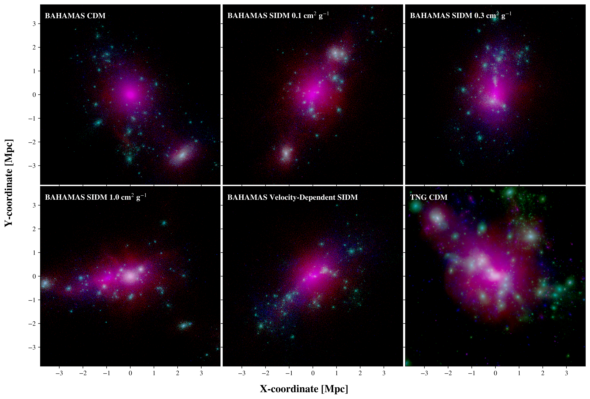

This project analyzes data from both the [TNG simulation](https://www.tng-project.org/data/) and the [BAHAMAS simulation](https://arxiv.org/abs/1603.02702) to develop methods to study the interactive nature of dark matter. 

The ROCKSTAR ([Robust Overdensity Calculation using K-Space Topologically Adaptive Refinement](https://iopscience.iop.org/article/10.1088/0004-637X/762/2/109)) halo finder is used on the TNG and BAHAMAS simulation particles to resolve cluster substructure from the 6D phase space. An RGB image of the projected matter in selected FoF halos from each of the six simulations analyzed in this work is shown below. The dark matter is shown in blue, gas in red and ROCKSTAR substructure in green. Regions in which all matter components overlap are white, while parts of the FoF with overlapping dark matter and gas are shown in purple. It can be seen that TNG exhibits a smoother projected mass due to a $\sim10^{2}$ higher simulation particle mass resolution: 

  

The cluster substructure found by ROCKSTAR serves as the "true substructure", which we will be compared to the observational substructure finder [DS+](https://github.com/josegit88/MilaDS). The DS+ algorithm finds substucture using two dimensional postions and line of sight velocity ($x$, $y$, $v_z$). he [coherence](https://iopscience.iop.org/article/10.3847/1538-4357/acbccb) is also calculated using both the project dark matter and gas as well as the 3D dark matter and gas. All funcitons used in this analysis are stored in the TNG_DA.py script with the script that actually runs this code in the DS+ folder.