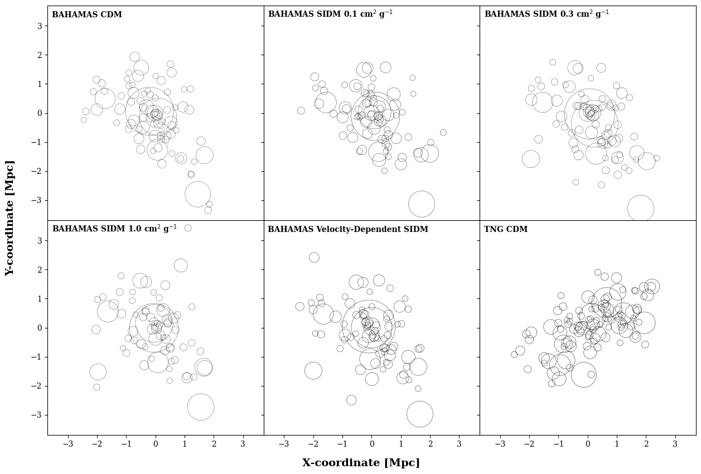

This project analyzes data from both the [TNG simulation](https://www.tng-project.org/data/) and the [BAHAMAS simulation](https://arxiv.org/abs/1603.02702) to develop methods to study the interactive nature of dark matter. 

The ROCKSTAR ([Robust Overdensity Calculation using K-Space Topologically Adaptive Refinement](https://iopscience.iop.org/article/10.1088/0004-637X/762/2/109)) halo finder is used on the TNG and BAHAMAS simulation particles to resolve cluster substructure from the 6D phase space. The substructures found by my implemenation of the ROCKSTAR code for a Friends-of-Friends halo in each simulation for the inner 2 Mpc of the cluster is shown below: 

  

The cluster substructure found by ROCKSTAR serves as the "true substructure", which we will be compared to the observational substructure finder [DS+](https://github.com/josegit88/MilaDS). The DS+ algorithm finds substucture using two dimensional postions and line of sight velocity ($x$, $y$, $v_z$). We have also added a virial mass calculation of each substructure that is identified as well as the entire virial mass of the galaxy cluster. All funcitons used in this analysis are stored in the TNG_DA.py script with the script that actually runs this code in the DS+ folder.

We also train a Convolutional Graph Neural Network (ConvGNN) on the dynamics of cluster-member galaxies from the BAHAMAS simulation simulations that include multiple dark matter simulations. The model is uses observable quantities ($x$, $y$, $v_z$) as inputs and predicts unobserved quantities ($z$, $v_x$, $v_y$). We then test the effectiveness of the ConvGNN on the TNG300 data as an out-of-dsitribution dataset. We will compare multiple loss functions, which include the mean-squared-loss error and the maximization of the Shanon Entropy of the galaxy clsuter derived using classical statistical mechanics. We can then more effectively probe the dynamical state of the clsuter and account for projection effects in both dynamical and weak lensing derived masses.

The methods from this study that prove to be the most effective at studying the interactiveness of dark matter from cluster substucture and cluster dynamics will be applied to observations from the Local Volume Complete Cluster Survey ([LoVoCCS](10.3847/1538-4357/ad67c6)) in a follow-up study. 